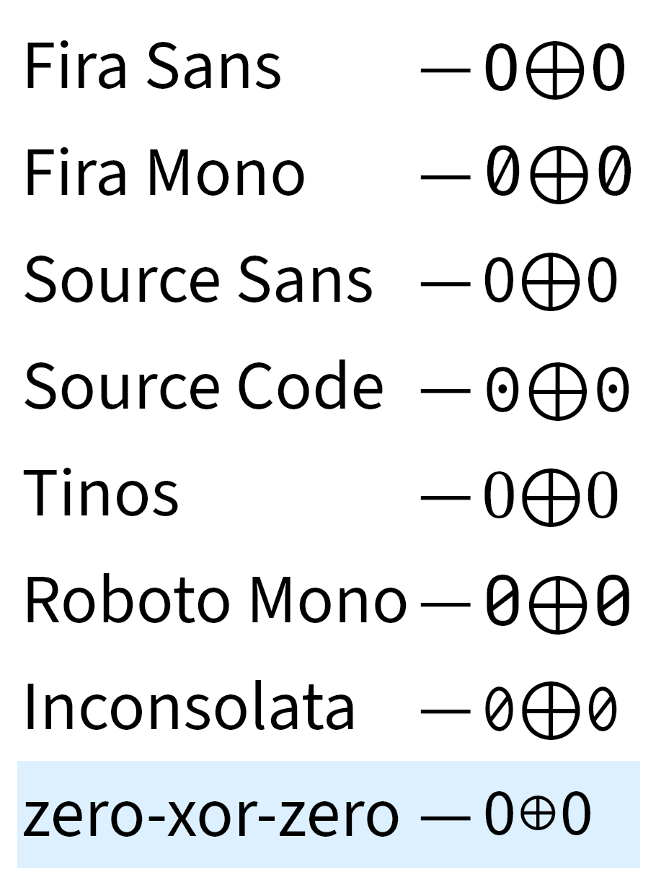

# `zero-xor-zero`

I was writing a blog post where I have to say "0⊕0=0" and I was really annoyed by the size and vertical positioning of the xor "⊕" in that font. So I tried out a different font, and then another one, and none of them looked right to me so I made a PoC font that just renders this one thing.

